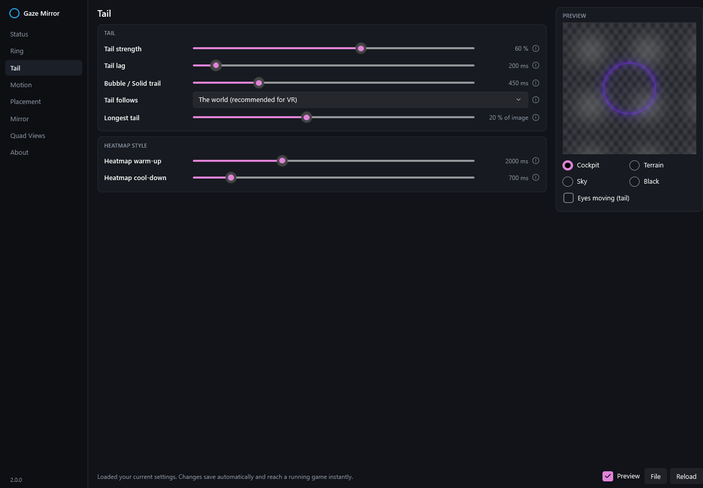
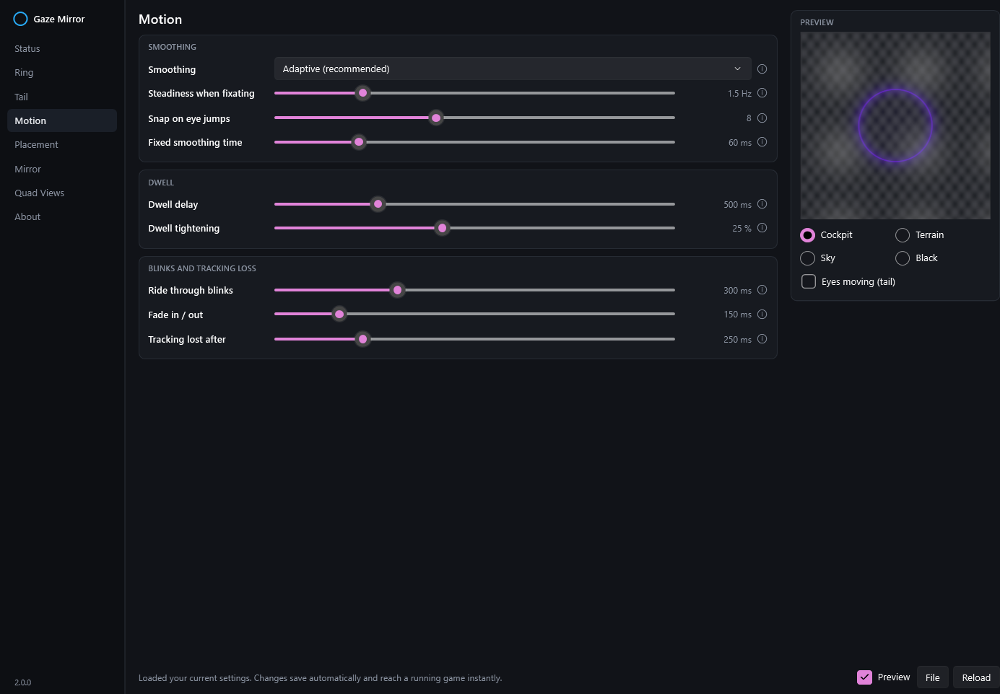
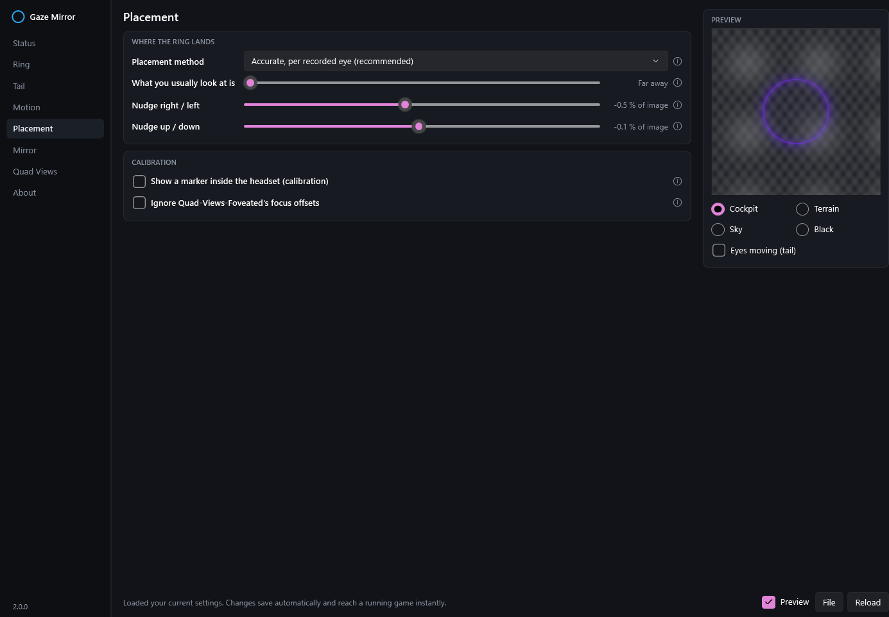
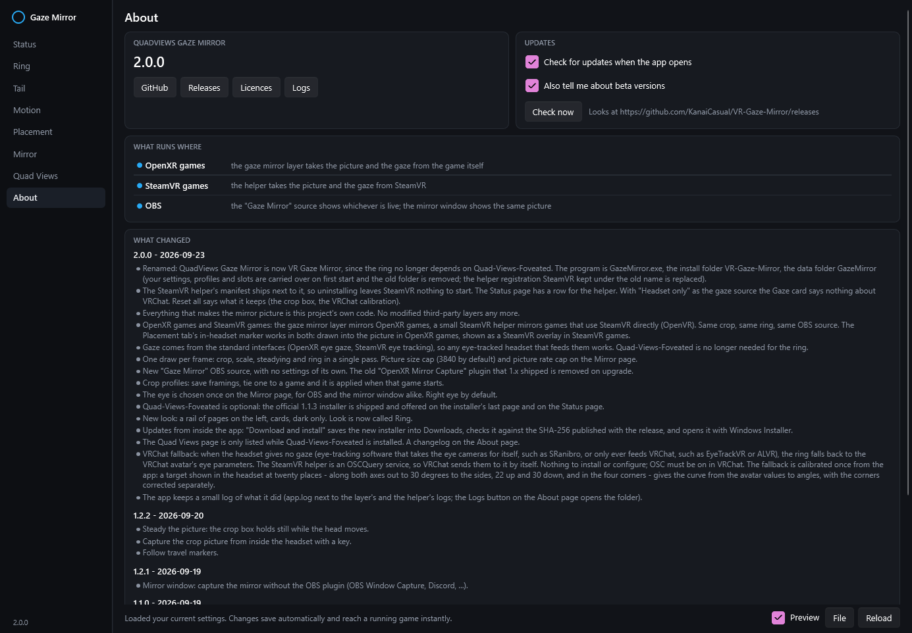

<p align="center"></p>

# VR Gaze Mirror

[](../../releases/latest)
[](../../releases/latest)
[](../../releases)
[](../../releases/latest)
[](../../issues)
[](LICENSE)

**A mirror of your headset view for recording and streaming that shows your viewers where you are looking** - a ring
in the style of Tobii Ghost, drawn on the mirror only, **never in the headset**. For OpenXR games and for SteamVR games,
with any eye-tracked headset whose software feeds the standard eye-tracking interfaces.

https://github.com/user-attachments/assets/97e8f727-dba7-481a-b9ef-01490a8ec5f4

*What your viewers see: the ring follows your eyes, its tail shows where they came from. You see none of it in the headset.*

[](https://www.youtube.com/watch?v=ixilzm8F_SY)

One installer sets up everything:

- **The gaze mirror layer** - an OpenXR API layer that copies what your headset shows in OpenXR games (DCS World and
  the like), crops, frames and steadies it, and draws the gaze ring on the copy.
- **The SteamVR helper** - the same for games that use SteamVR directly (VRChat and the like). It starts and stops with
  SteamVR by itself.
- **The "Gaze Mirror" OBS source** - reads the picture straight off the graphics card. Or use the **mirror window** with
  anything that can capture a window (OBS, Discord, ...).
- **A settings app** - everything below is set there, live, with nothing to edit by hand.
- **Quad-Views-Foveated, optionally** - Matthieu Bucchianeri's official installer is bundled and offered at the end of
  setup, for eye-tracked foveated rendering in OpenXR games. The ring does not need it.

*Called "QuadViews Gaze Mirror" up to version 1.2.2, when the ring was built on modified Quad-Views-Foveated and
OpenXR-Layer-OBSMirror layers. Since 2.0 everything that makes the picture is this project's own code, and Quad-Views-Foveated
is an optional extra.*

**Download:** the latest `VR-Gaze-Mirror-<version>.msi` is on the
[Releases page](../../releases/latest); the release notes say what changed.

---

## Contents

- [What you need](#what-you-need)
- [Installing, updating, removing](#installing-updating-removing)
- [Recording and streaming: two ways](#recording-and-streaming-two-ways)
- [The settings app, page by page](#the-settings-app-page-by-page)
- [How it works](#how-it-works)
- [Troubleshooting](#troubleshooting)
- [Building from source](#building-from-source)
- [Things to know](#things-to-know)
- [Credits and licence](#credits-and-licence)

---

## What you need

- Windows 10 or 11, 64-bit.
- A headset **with eye tracking**, with eye tracking switched on in the headset's own software, and that software
  feeding it to the standard interface the game uses: OpenXR's eye-gaze extension for OpenXR games, SteamVR's eye
  tracking for SteamVR games (Pimax Crystal, Varjo, Quest Pro over Virtual Desktop, Vive Pro Eye, ...). Without gaze
  the mirror still works; there is just no ring.
- **OpenXR games** that render with **Direct3D 11** (DCS World, ...), or **SteamVR games** (VRChat, ...).
- For recording through the plugin: **OBS Studio**. For the mirror window: nothing else.

Developed and tested with a Pimax Crystal Super through SteamVR, in DCS World and VRChat.

## Installing, updating, removing

1. Close your game and OBS, then run the `.msi`. Windows SmartScreen will warn, because nothing here is code-signed:
   "More info" > "Run anyway". A first install offers a desktop shortcut.
2. The last page offers to install **Quad-Views-Foveated 1.1.3** if it is not on the PC. Say yes if you want foveated
   rendering in OpenXR games; the ring works either way.
3. Start **VR Gaze Mirror** from the Start menu. The **Status** page should show green dots for the layer, the OBS
   plugin and the SteamVR helper.

**Coming from 1.x:** just run the installer over it. The two modified layers and the old "OpenXR Mirror Capture" OBS
plugin that 1.x put into OBS are removed, your settings, presets and crop pictures are carried over, and the old
"QuadViews Gaze Mirror" data folder is cleaned up. Replace the old source in your OBS scenes with the new **Gaze Mirror**
source (the old one shows black).

**Updating:** the app tells you when a newer release exists. **Download and install** saves the new installer into your
Downloads folder, checks it against the SHA-256 published with the release, and opens it with Windows Installer; your
settings stay. Or run the newer `.msi` over the old one yourself. **Repair / remove:** run the installer again (or
"Modify" in the installed-apps list) for a page with **Repair** and **Uninstall**. Uninstalling leaves your settings
files in place, and SteamVR forgets the helper.

## Recording and streaming: two ways

Both show the same picture: the eye you chose, with the gaze ring, cropped, framed and steadied the way you set it up on
the **Mirror** page. Both can be used at the same time.

### 1. OBS with the Gaze Mirror source - the cheapest, best for recording

The installer puts the plugin into OBS.

1. In OBS: **Sources > + > Gaze Mirror**. It has no settings of its own; everything is on the Mirror page.
2. Start your game. The picture appears once a VR session is running.
3. Select the source and press **Ctrl+F** (Transform > Fit to screen) once. After that it keeps fitting your canvas,
   whatever size the crop box has.

OBS reads the picture straight off the graphics card. While OBS is not showing the source, no mirror work is done at all.

### 2. The mirror window - for Discord, or anything else that captures windows

No OBS plugin involved. On the **Mirror** page press **Open**: a window with the mirror picture appears on the monitor
you chose, **behind every other window** (behind a borderless game too) and without ever taking the focus. Window
capture still sees it there.

- **Discord:** Share Your Screen > Applications > *VR Gaze Mirror - Mirror*.
- **OBS without the plugin:** Sources > + > **Window Capture** > that window.
- **Size** and **Rate** decide what the capturing program gets (for example 1920 x 1080 at 30 fps for Discord). Smaller
  and slower is cheaper: this way costs more graphics card time than the plugin, because the window has to redraw the
  picture and the capturing program copies it again.
- **Title bar** for capture tools that only list windows that have one.

## The settings app, page by page

Every setting has an **(i)** with an explanation; changes save automatically and **reach a running game at once** (except
the Quad Views page - see there). The app is small on purpose: it is meant to sit next to OBS while you tune.

### Status


- **Components:** the gaze mirror layer, the OBS plugin, the SteamVR helper and (optionally) Quad-Views-Foveated, each
  with what is wrong if something is. The line at the top says what is being mirrored right now and whether gaze
  arrives.
- **OpenXR API layers:** every layer on your PC in the order games load them, with a tick box to switch each on or off
  and arrows to **reorder** (Windows asks for permission for that one change; the app itself never runs as
  administrator). The app knows the ordering rules of common layers and offers **Fix order** when something is wrong.

### Ring


How the gaze indicator is drawn, with a **live preview** over cockpit, terrain, sky or black.

- **Styles:** Ghost ring with teardrop tail (recommended), plain ring, soft glow, small dot, spotlight (darkens
  everything else), bubble and solid blob with a fading trail, and a **heatmap** (blue = glance, red = stare; spots stay
  where you looked and cool down).
- Colour, size, line thickness, softness, glow, brightness, blending (light or paint), solidity, fill and a dark outline
  for bright backgrounds.
- **Presets** (Subtle, Crisp, Soft band, Neon), **Reset all**, and three slots of your own under **Mine** to save and
  compare looks.

### Tail



The teardrop tail of the Ghost style and the trails of the other styles: strength, lag, longest tail, heatmap warm-up and
cool-down, and whether the tail is anchored to **the world** (recommended in VR: looking around by turning your head
stretches it too) or to the screen.

### Motion



How the ring follows your eyes. By default a **One-Euro filter**: very steady while you fixate something, instant on eye
jumps. Also: **dwell** (hold your gaze on something and the ring tightens, so viewers can tell reading from glancing),
riding through blinks, fade in and out, and when tracking counts as lost.

### Placement



Where the ring lands in the picture. Normally nothing to do. If the ring sits beside what you look at:

- Switch on **"Show a marker inside the headset (calibration)"** - a small bracket reticle appears *in the headset*
  where the ring is on the mirror. Look at something small and nudge with the sliders, or in the game with
  **Ctrl+Alt+arrow keys** (Shift = bigger steps; these keys only exist while the marker is on). Switch it off again when
  done - it is only ever switched from this page. In OpenXR games the layer draws it into the picture; in SteamVR games
  the helper shows it as a small SteamVR overlay two metres out along your line of sight.
- **What you usually look at is ...** sets the distance used to place the ring (a cockpit panel is close, the world is
  far): the mirror shows one eye, and the two eyes see close things in different places.

### Mirror


*Blue frame = what is recorded; blue tint = how far it follows the gaze; amber lines = still zone; green band = room for steadying.*

**Picture:** which **eye** is mirrored (right by default), the **picture size** cap (3840 on the longest side by default,
so a 5000-pixel eye image does not go to OBS at full size) and the **picture rate** cap. These apply to OBS and the
mirror window alike.

**Crop profiles** (top of the page): save a framing under a name, and give it a game's program file (DCS.exe,
VRChat.exe, ...) to have it applied whenever that game starts. Edits go into the chosen profile.

**Mirror window:** Open / Close, which monitor (or an ordinary window), size, rate and the title-bar option.

**Crop the picture:** instead of typing crop percentages into OBS, drag a box - locked to a shape (16:9, 9:16, 1:1,
4:3, 4:5, 21:9 or free) - on a picture of the whole eye image. The picture handed out **is that box**. Drag inside the
box to move it, a corner or the mouse wheel to resize, **Centre**, **Largest**, and **Lock** against stray clicks.

**The picture behind the box:**

- **Refresh picture** takes one from the running game right now.
- **Capture from headset** takes it the way you actually sit: press it (a large banner says what to do), put the headset
  on, look straight ahead and press the key - **Pause** by default, changeable with the key button. You hear a sound, and
  it switches itself off. It takes one picture of **each eye**, and that picture is **kept** - through restarts too -
  until you press Refresh picture. The key is only looked at while armed.

**Follow my gaze (up / down):** a 16:9 box only covers about half the height of the eye image, so looking down at your
knees or up at the canopy leaves the frame. With this on, the box glides up or down just far enough to keep what you
look at in frame - like a camera operator.

- **Still zone** (dashed amber lines): the middle part of the box in which your gaze moves nothing.
- **Reach** (blue tint): how far the box may travel. Two dotted lines show where the frame **ends when you look all the
  way up** and **starts when you look all the way down**.
- **Glide**, **Return home** and **Return after**: how softly it moves, and whether and when it goes back.

**Steady the picture:** takes small head movement and tracking jitter out of the picture. The head orientation goes
through a One-Euro filter and the box counter-moves the difference.

- It adds **no delay**: no frames are held back or compared - it only uses the head position the game rendered with.
- **Steadiness** (lower = steadier, but the picture trails further behind a head turn), **Follow quick turns**, and
  **Room to move** - shown as a green band around the box (and around the blue reach). The box cannot enter that band, so
  it always stays inside the image; switching steadying on moves or shrinks the box to make room.
- It needs the crop to be on, and corrects turning and nodding - not tilting the head sideways.

Cropping, following, steadying and the ring happen in the one pass that makes the picture, so they cost nothing extra.

**Gaze source:** the ring's main source is the headset itself - OpenXR's eye-gaze extension in OpenXR games, SteamVR's
eye tracking in SteamVR games. Exact angles, nothing to set up, and as long as that gaze arrives it is all the ring uses.

The **VRChat fallback** is for when it does not arrive. Some eye-tracking software takes the eye cameras for itself
(SRanibro), or only ever feeds VRChat (EyeTrackVR, Quest Pro over ALVR, ...); the headset's own gaze is then gone, and
the only trace of where you look is the VRChat avatar's eye parameters, driven through
[VRCFaceTracking](https://github.com/benaclejames/VRCFaceTracking). For those, the SteamVR helper is an **OSCQuery
service**: VRChat finds it on the machine and sends it the avatar's parameters, and the eye ones drive the ring. Nothing
to install or set up - OSC has to be on in VRChat (it is, for every face-tracking user) and the avatar needs eye
parameters (face-tracking avatars have them). The Gaze card says *VRChat: eye parameters arriving* once it works, and
"Headset, else VRChat" (the default) switches to the fallback by itself whenever the headset gives no gaze.

Whether the fallback is needed at all depends on the eye-tracking software, not on the headset. On a Pimax Crystal,
for example, SRanibro stops the Tobii service to take the eye cameras for itself, so the headset's own gaze is gone and
the ring falls back; [BrokenEye](https://github.com/ghostiam/BrokenEye) with the SRanipal model reads the same cameras
through the Tobii service instead, the headset's gaze stays available, and the ring never needs the fallback - full
reach, no calibration, exact angles.

**Calibrate VRChat gaze** (for the fallback only - the headset's own eye tracking needs none): the avatar's eye values
are not angles, and not in proportion to them either, so the helper measures once how they relate to where you look.
Press the button with the headset on and VRChat running: a small ring-and-dot target appears inside the headset at
twenty places, about two seconds each - straight ahead, then out to 30 degrees to each side, 22 up and 30 down, then
the four corners. Follow it with your eyes only, head still; the status line counts the targets. After about 45 seconds
the target disappears and the ring lands where you look. Redo it after changing eye-tracking software or its own
calibration; **Forget** drops it.

**Known limit of the fallback:** the ring can only go as far as the eye-tracking software lets the avatar's eyes go.
**SRanibro caps the gaze it sends to VRChat at about 30 degrees in every direction** on the headsets it serves (Pimax
Crystal/Super, StarVR One, Varjo); past that the ring holds at the edge of the range while your eyes carry on. The cap
is in SRanibro's output, not in this project - check its gaze range settings, or ask its author.

### Quad Views


Only listed while Quad-Views-Foveated is installed. Its own settings, with the same sliders and value logic as
TallyMouse's *QuadViews Companion* (both can be used on the same file): focus size, vertical offset, foveate and
peripheral resolution, sharpening, transition, Turbo mode and the debug views. **These are read when a game starts:
press Apply, then restart the game.**

- **Render load:** how many pixels per frame your settings make the game render - for the last game start, the saved
  file, and what Apply would give.
- **Presets:** *Give me FPS*, *TM's Favorite*, *QV defaults*, and three slots of your own.
- One deliberate difference from the Companion: values are also written to the **common** part of the file. Headset
  sections such as `[Pimax]` only apply when the OpenXR runtime's name contains that word - a Pimax driven through
  SteamVR matches none of them and silently gets the built-in 35 % focus size otherwise.
- A backup of the file is made before the first change of each session. **File** and **Log** open them.

### About



Version, the update check (on opening; optional betas), the changelog, and **Logs** for the folder with the app's, the
layer's and the helper's logs.

## How it works

One core, two producers, any number of readers:

- **The gaze mirror layer** (`XR_APILAYER_NOVENDOR_gaze_mirror`) sits in OpenXR games. Each frame it reads the eye
  gaze the runtime provides, the head pose and the game's eye images, and makes the mirror picture.
- **The SteamVR helper** (`GazeMirrorHelper.exe`) does the same for SteamVR games from SteamVR's own mirror texture,
  eye tracking and poses. SteamVR starts it with itself, and it leaves when SteamVR closes.
- **The core** they share does everything in a single pass straight from the game's image: crop, gaze-following, picture
  steadying, scaling and the ring. The result goes into a shared texture that the **OBS plugin** and the **mirror
  window** read - both at once, if you like.
- **The settings app** writes the settings file and bumps a counter in shared memory; the producers pick the change up
  on the next frame (a memory read, no system call). With the app closed, nothing is ever re-read.

**Nothing polls.** With no reader - OBS not showing the source, mirror window closed - no mirror work is done. The
helper sleeps on an event until a reader turns up. Keys are only looked at while the feature that uses them is on. The
app listens for file-change notifications rather than checking on a timer.

**The installer** is a plain, declarative MSI: no code of ours runs during setup, and it never touches other products'
registry entries. The settings app never runs as administrator. The one exception - switching or reordering layers on the
Status page - is done by Windows' own `reg.exe` after a UAC prompt.

Where things are:

| What | Where |
|---|---|
| Program, layer, helper, mirror window | `C:\Program Files\VR-Gaze-Mirror` |
| Ring, crop, follow, steadying, gaze settings | `%LocalAppData%\XR_APILAYER_NOVENDOR_OBSMirror_gaze.cfg` |
| App preferences, saved slots, crop profiles and pictures, layer-order backups | `%LocalAppData%\GazeMirror\` |
| Logs: `app.log`, `gaze-mirror-layer.log`, `gaze-mirror-helper.log` | `%LocalAppData%\GazeMirror\` |
| Quad-Views-Foveated settings and log (if installed) | `%LocalAppData%\Quad-Views-Foveated\` |

## Troubleshooting

- **Black Gaze Mirror source in OBS** - no VR session is running yet, or the game is one the layer cannot mirror (not
  Direct3D 11). The Status page's top line says what is being mirrored.
- **No ring** - eye tracking is off in the headset software, the software does not feed the standard interface (see
  Gaze source above), or the ring is switched off on the Ring page. The Status page says whether gaze arrives.
- **Ring beside what you look at** - Placement page, calibration marker.
- **Ring stops short in VRChat** - you are on the VRChat fallback and the eye-tracking software caps the gaze it sends;
  see the known limit under Gaze source.
- **The crop does nothing** - press Ctrl+F once on the OBS source.
- **Quad Views changes do nothing** - press Apply and restart the game; check the Render load line after the next start.
- **A layer is red or the order is wrong** - Status page > Fix order, or run the installer again > Repair.
- **The mirror window takes ten seconds to appear the first time** - antivirus software looking at a new, unsigned
  program.
- **Discord does not list the mirror window** - tick "Title bar".
- **Something odd** - About page > Logs; the three log files say what each part did.

## Building from source

Needs Visual Studio 2022 (C++ workload), the .NET 10 SDK and the GitHub CLI (`gh`, for fetching third-party files the
first time).

```powershell
git clone <this repo>
.\v2\Get-External.ps1              # once: OpenVR SDK, OBS headers, the Quad-Views-Foveated installer (only licences are kept in git)
.\Build-Installer.ps1 -Version 2.0.0   # everything, the offline layer test, and dist\VR-Gaze-Mirror-2.0.0.msi with its .sha256
```

| Path | What |
|---|---|
| `v2/core/` | The shared core: settings, crop and framing, steadying, ring, renderer, publisher |
| `v2/layer/` | The OpenXR API layer |
| `v2/openvr-helper/` | The SteamVR helper: OpenVR mirror, VRChat OSC, the calibration, the in-headset marker |
| `v2/obs-plugin/` | The "Gaze Mirror" OBS source |
| `v2/mirror-window/` | The capturable mirror window |
| `v2/viewer/` | A small viewer of the shared picture, for development |
| `v2/test/` | The offline layer test: plays game and runtime, checks the picture, the crop tool and the marker |
| `v2/protocol/` | The shared-memory blocks every part agrees on |
| `GazeOverlayApp/` | The settings app (WPF, .NET 10) |
| `Installer/` | WiX 5 project for the MSI |
| `tools/` | The logo and installer-artwork generators, an offline ring preview, an MSI inspector, a clip reviewer |

The app has two headless checks: `GazeMirror.exe --selftest <folder>` and `--screenshots <folder> [width height]`.

**Every release - beta or not - must have its own `x.y.z` number** (tag `v2.0.0`, `v2.0.1-beta`, ...). Windows Installer
only upgrades to a higher number, and the update check compares the numbers, so a beta and its final release cannot share
one. Betas are GitHub *pre-releases* and are only announced to people who ticked "Also tell me about beta versions".
Every release must carry both the `.msi` and its `.msi.sha256`; the in-app updater refuses a release without the checksum.

## Things to know

- **Nothing is code-signed.** Windows SmartScreen warns about the installer, and games with anti-cheat may refuse to load
  the layer.
- Setup is a plain MSI on purpose: an earlier self-installing `.exe` was quarantined by antivirus heuristics half-way
  through an install.
- Silent install without the desktop shortcut: `msiexec /i VR-Gaze-Mirror-x.y.z.msi /qn DESKTOPSHORTCUT=0`.
- OpenXR games are mirrored when they render with Direct3D 11. Direct3D 12 and Vulkan games are not mirrored yet.
  SteamVR games are mirrored through SteamVR's own mirror, whatever they render with.
- The SteamVR helper needs SteamVR and OBS on the same graphics card.
- TallyMouse's QuadViews Companion keeps working on the same settings file; only its "QV Defaults" button fails, because
  it looks for the original product's install folder (use the *QV defaults* preset here instead).

## Credits and licence

- [Quad-Views-Foveated](https://github.com/mbucchia/Quad-Views-Foveated) by Matthieu Bucchianeri (MIT): its official,
  unmodified 1.1.3 installer is bundled as an optional extra.
- [OpenXR-Layer-OBSMirror](https://github.com/Jabbah/OpenXR-Layer-OBSMirror) by Jabbah (MIT): the 1.x versions of this
  project were built on it, and the 2.0 layer keeps its settings file name so upgrades carry over.
- [OBS Studio](https://github.com/obsproject/obs-studio) (GPL-2): the OBS plugin is built against its headers and is
  itself GPL-2; its licence is installed next to it.
- [OpenVR](https://github.com/ValveSoftware/openvr) by Valve (BSD-3): the SteamVR helper's library, installed next to it.
- The layer-order rules on the Status page express the same facts as
  [OpenXR-API-Layers-GUI](https://github.com/fredemmott/OpenXR-API-Layers-GUI) by Fred Emmott (ISC).
- The Quad Views page follows the slider logic of TallyMouse's QuadViews Companion; it is not their app.
- The ring was inspired by Tobii Ghost.

MIT - see [LICENSE](LICENSE). Third-party licence files are installed under `Licences` next to the program.
