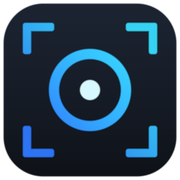
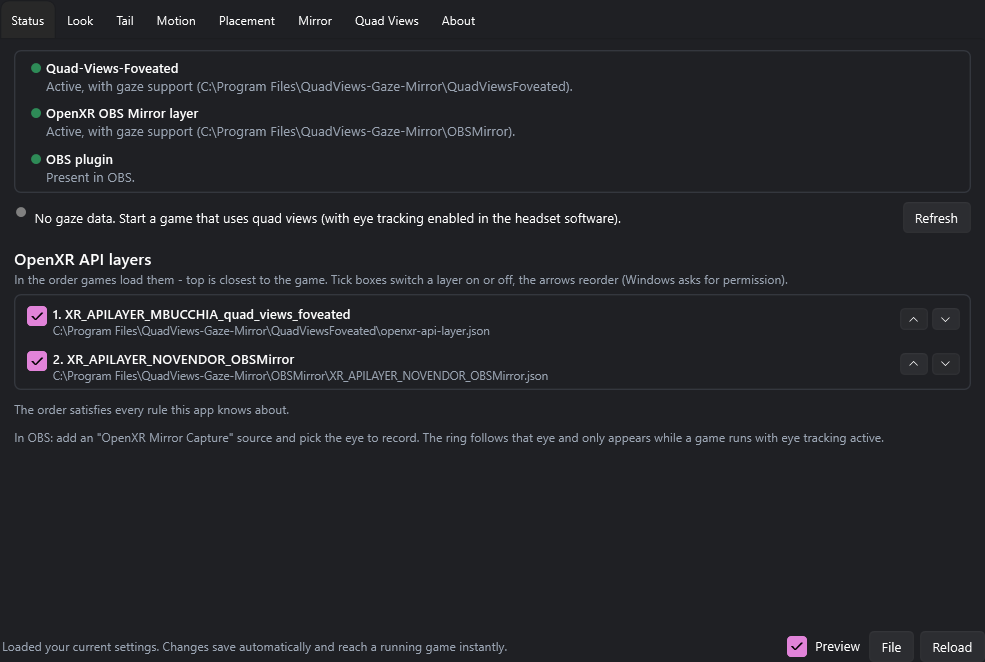
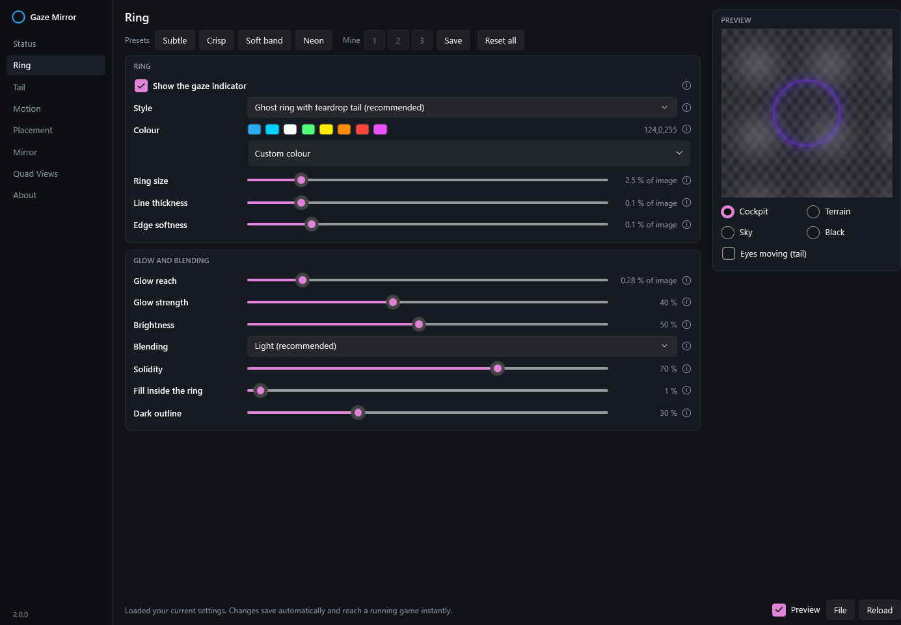
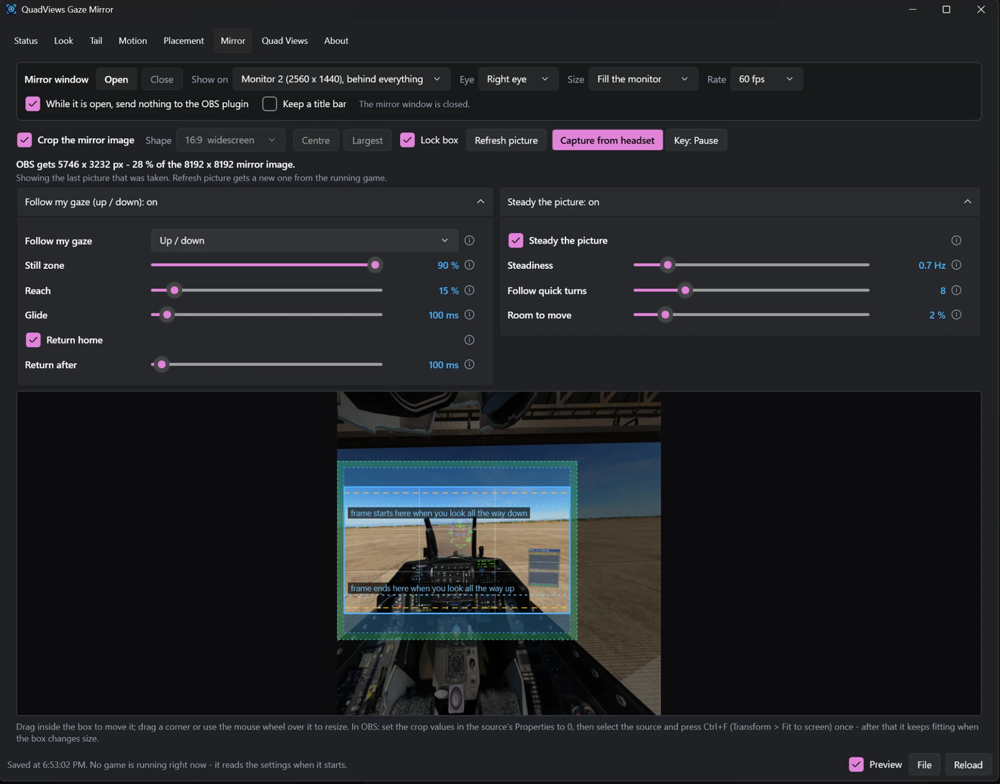
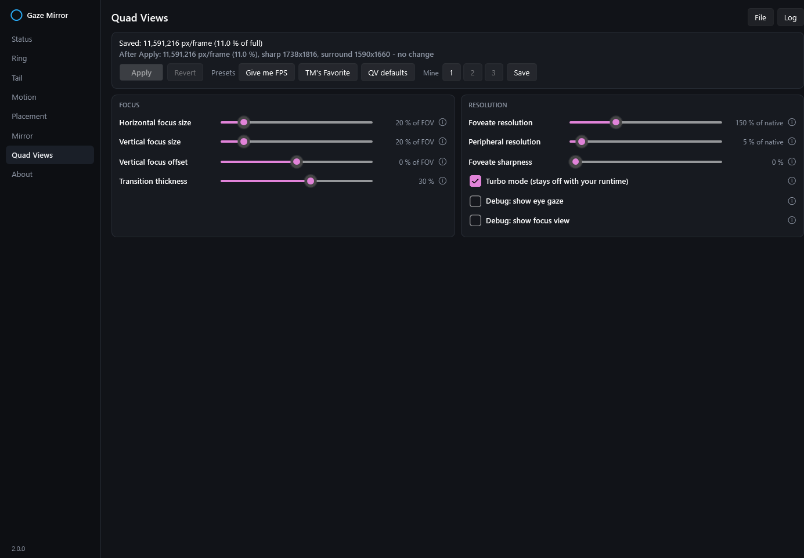

<p align="center"></p>

# VR Gaze Mirror

[](../../releases/latest)
[](../../releases/latest)
[](../../releases)
[](../../releases/latest)
[](../../issues)
[](LICENSE)

**Foveated rendering (quad views) for OpenXR games, plus a mirror of your headset view for recording and streaming that
shows your viewers where you are looking** - a ring in the style of Tobii Ghost, drawn on the mirror only, **never in the
headset**.

https://github.com/user-attachments/assets/97e8f727-dba7-481a-b9ef-01490a8ec5f4

*What your viewers see: the ring follows your eyes, its tail shows where they came from. You see none of it in the headset.*

[](https://youtu.be/6375tGa7_gk)

One installer sets up everything:

- **Quad-Views-Foveated** - eye-tracked foveated rendering: sharp where you look, cheap everywhere else.
- **The OpenXR mirror layer** - a copy of what your headset shows, for OBS (through a plugin) or for anything that can
  capture a window (OBS, Discord, ...), with the gaze ring, a crop tool, gaze-following framing and picture steadying.
- **A settings app** - everything below is set there, live, with nothing to edit by hand.

*Called "OpenXR Gaze Overlay" up to version 0.9.0.*

> **Unofficial community build.** This project contains modified builds of
> [Quad-Views-Foveated](https://github.com/mbucchia/Quad-Views-Foveated) by Matthieu Bucchianeri and
> [OpenXR-Layer-OBSMirror](https://github.com/Jabbah/OpenXR-Layer-OBSMirror) by Jabbah. They did not build, test or
> endorse it. **Please do not ask them for support with it** - use this repository's Issues instead.

**Download:** the latest `VR-Gaze-Mirror-<version>.msi` is on the
[Releases page](../../releases/latest); the release notes say what changed.

---

## Contents

- [What you need](#what-you-need)
- [Installing, updating, removing](#installing-updating-removing)
- [Recording and streaming: three ways](#recording-and-streaming-three-ways)
- [The settings app, tab by tab](#the-settings-app-tab-by-tab)
- [How it works](#how-it-works)
- [Troubleshooting](#troubleshooting)
- [Building from source](#building-from-source)
- [Things to know](#things-to-know)
- [Credits and licence](#credits-and-licence)

---

## What you need

- Windows 10 or 11, 64-bit.
- A headset **with eye tracking** that works with Quad-Views-Foveated (Pimax Crystal, Varjo, Quest Pro, ...), with eye
  tracking switched on in the headset's own software. Without eye tracking the foveated rendering still works (fixed in
  the middle), but there is no gaze ring.
- An OpenXR game that renders with **Direct3D 11** and supports **quad views** - for example DCS World.
- For recording through the plugin: **OBS Studio**. For the mirror window: nothing else.

Developed and tested with a Pimax Crystal through SteamVR, in DCS World.

## Installing, updating, removing

1. **Uninstall the originals first**, if you have them: Quad-Views-Foveated (Windows' installed-apps list) and the OpenXR
   OBS Mirror layer (its own `Uninstall-Layer.ps1`). Two copies of a layer cannot be active together, so the installer
   refuses to run while they are there. Your Quad-Views-Foveated settings in `%LocalAppData%\Quad-Views-Foveated` are kept.
2. Close your game and OBS, then run the `.msi`. Windows SmartScreen will warn, because nothing here is code-signed:
   "More info" > "Run anyway". A first install offers a desktop shortcut.
3. Start **VR Gaze Mirror** from the Start menu. The **Status** tab should show three green dots.

**Updating:** run the newer `.msi` over the old one; your settings stay. **Repair / remove:** run the installer again
(or "Modify" in the installed-apps list) for a page with **Repair** and **Uninstall**. Uninstalling leaves your settings
files and the OBS plugin in place.

The app tells you when a newer release exists (it only links to the release page - it never downloads or installs
anything).

## Recording and streaming: three ways

All three show the same picture: the eye you choose, with the gaze ring, cropped, framed and steadied the way you set it
up on the **Mirror** tab.

### 1. OBS with the mirror plugin - the cheapest, best for recording

The installer puts the (unmodified) OpenXR Mirror plugin into OBS.

1. In OBS: **Sources > + > OpenXR Mirror Capture**. In its properties choose the **eye** and set all its **crop values to
   0** (cropping is done in the app instead - see the Mirror tab).
2. Start your game. The picture appears once a VR session is running.
3. Select the source and press **Ctrl+F** (Transform > Fit to screen) once. After that it keeps fitting your canvas,
   whatever size the crop box has.

OBS reads the mirror texture straight off the graphics card - no copy, no extra pass. While OBS is not showing the
source, the layer does no mirror work at all.

### 2. The mirror window - for Discord, or anything else that captures windows

No OBS plugin involved. On the **Mirror** tab press **Open**: a window with the mirror picture appears on the monitor you
chose, **behind every other window** (behind a borderless game too) and without ever taking the focus. Window capture
still sees it there.

- **Discord:** Share Your Screen > Applications > *VR Gaze Mirror - Mirror*.
- **OBS without the plugin:** Sources > + > **Window Capture** > that window.
- **Size** and **Rate** on the Mirror tab decide what the capturing program gets (for example 1920 x 1080 at 30 fps for
  Discord). Smaller and slower is cheaper: this way costs more graphics card time than the plugin, because the window has
  to redraw the picture and the capturing program copies it again.
- Tick **"While it is open, send nothing to the OBS plugin"** (the default) and an OpenXR Mirror source left in an OBS
  scene shows black and costs nothing meanwhile.

### 3. Both at once

Untick that box, and OBS (plugin) and the mirror window (Discord) get the picture at the same time - for example
recording locally while showing friends your view.

## The settings app, tab by tab

Every setting has an **(i)** with an explanation; changes save automatically and **reach a running game at once** (except
the Quad Views tab - see there). The app is small on purpose: it is meant to sit next to OBS while you tune.

### Status



- **Three lights:** both layers installed and active, and the plugin present in OBS. A fourth line shows **live gaze
  data** while a game runs.
- **OpenXR API layers:** every layer on your PC in the order games load them, with a tick box to switch each on or off
  and arrows to **reorder** (Windows asks for permission for that one change; the app itself never runs as
  administrator). The app knows the ordering rules of common layers and offers **Fix order** when something is wrong -
  the one that matters here: Quad-Views-Foveated must be above the mirror layer.

### Look



How the gaze indicator is drawn, with a **live preview** over cockpit, terrain, sky or black.

- **Styles:** Ghost ring with teardrop tail (recommended), plain ring, soft glow, small dot, spotlight (darkens
  everything else), bubble and solid blob with a fading trail, and a **heatmap** (blue = glance, red = stare; spots stay
  where you looked and cool down).
- Colour, size, line thickness, softness, glow, brightness, blending (light or paint), solidity, fill and a dark outline
  for bright backgrounds.
- **Presets** (Subtle, Crisp, Soft band, Neon), **Reset all**, and three slots of your own under **Mine** to save and
  compare looks.

### Tail

The teardrop tail of the Ghost style and the trails of the other styles: strength, lag, longest tail, heatmap warm-up and
cool-down, and whether the tail is anchored to **the world** (recommended in VR: looking around by turning your head
stretches it too) or to the screen.

### Motion

How the ring follows your eyes. By default a **One-Euro filter**: very steady while you fixate something, instant on eye
jumps. Also: **dwell** (hold your gaze on something and the ring tightens, so viewers can tell reading from glancing),
riding through blinks, fade in and out, and when tracking counts as lost.

### Placement

Where the ring lands in the picture. Normally nothing to do. If the ring sits beside what you look at:

- Switch on **"Show a marker inside the headset (calibration)"** - a marker appears *in the headset* where the ring is on
  the mirror. Look at something small and nudge with the sliders, or in the game with **Ctrl+Alt+arrow keys** (Shift =
  bigger steps; these keys only exist while calibration is on). Switch it off again when done - it is the only thing in
  this project that draws into the headset, and it is only ever switched from this tab.
- **What you usually look at is ...** sets the distance used to place the ring (a cockpit panel is close, the world is
  far): the mirror shows one eye, and the two eyes see close things in different places.

### Mirror



*Blue frame = what is recorded; blue tint = how far it follows the gaze; amber lines = still zone; green band = room for steadying.*

**Mirror window** (top): Open / Close, which monitor (or an ordinary window), which eye, output size, picture rate, the
"send nothing to the OBS plugin" box, and a title-bar option for capture tools that only list windows that have one. All
of it applies at once to an open window.

**Crop the mirror image:** instead of typing crop percentages into OBS, drag a box - locked to a shape (16:9, 9:16, 1:1,
4:3, 4:5, 21:9 or free) - on a picture of the whole eye image. The layer then hands out **only that box**, so the OBS
source *is* the box. Drag inside the box to move it, a corner or the mouse wheel to resize, **Centre**, **Largest**, and
**Lock box** against stray clicks.

**The picture behind the box:**

- **Refresh picture** takes one from the running game right now.
- **Capture from headset** takes it the way you actually sit: press it (a large banner says what to do), put the headset
  on, look straight ahead and press the key - **Pause** by default, changeable with the key button. You hear a sound, and
  it switches itself off. It takes one picture of **each eye** (a selector shows either one), and that picture is
  **kept** - through restarts too - until you press Refresh picture. The key is only looked at while armed, by the layer
  inside the game; the game sees it as well.

**Follow my gaze (up / down):** a 16:9 box only covers about half the height of the eye image, so looking down at your
knees or up at the canopy leaves the frame. With this on, the box glides up or down just far enough to keep what you
look at in frame - like a camera operator.

- **Still zone** (dashed amber lines): the middle part of the box in which your gaze moves nothing.
- **Reach** (blue tint): how far the box may travel. Two dotted lines show where the frame **ends when you look all the
  way up** and **starts when you look all the way down**.
- **Glide**, **Return home** and **Return after**: how softly it moves, and whether and when it goes back.

**Steady the picture:** takes small head movement and tracking jitter out of the picture. The head orientation goes
through a One-Euro filter and the box counter-moves the difference.

- It adds **no delay**: no frames are held back or compared - it only uses the head position the game rendered with.
- **Steadiness** (lower = steadier, but the picture trails further behind a head turn), **Follow quick turns**, and
  **Room to move** - shown as a green band around the box (and around the blue reach). The box cannot enter that band, so
  it always stays inside the image; switching steadying on moves or shrinks the box to make room.
- It needs the crop to be on, and corrects turning and nodding - not tilting the head sideways.

Moving the box is only a different source rectangle for the copy the layer makes anyway, so cropping, following and
steadying cost nothing.

**Gaze from** (the Gaze card): normally the ring gets the eyes from the headset itself - OpenXR's eye-gaze extension in
OpenXR games, SteamVR's eye tracking in SteamVR games. Some headsets' software feeds neither, but does drive a VRChat
avatar's eye parameters (through [VRCFaceTracking](https://github.com/benaclejames/VRCFaceTracking) with SRanibro,
EyeTrackVR, Quest Pro over ALVR, ...). For those, the SteamVR helper is an **OSCQuery service**: VRChat finds it on the
machine and sends it the avatar's parameters, and the eye ones drive the ring. Nothing to install or set up - OSC has to
be on in VRChat (it is, for every face-tracking user) and the avatar needs eye parameters (face-tracking avatars have
them). The Gaze card says *VRChat: eye parameters arriving* once it works.

**Calibrate VRChat gaze** (only for this source - the headset's own eye tracking needs none): the avatar's eye values
are not angles, and not in proportion to them either, so the helper measures once how they relate to where you look.
Press the button with the headset on and VRChat running: a small ring-and-dot target appears inside the headset at
sixteen places, about two seconds each - straight ahead, then out to 35 degrees to each side, 22 up and 30 down.
Follow it with your eyes only, head still; the status line counts the targets. After about 35 seconds the target
disappears and the ring lands where you look. Redo it after changing eye-tracking software or its own calibration;
**Forget** drops it.

### Quad Views



Quad-Views-Foveated's own settings, with the same sliders and value logic as TallyMouse's *QuadViews Companion* (both can
be used on the same file): focus size, vertical offset, foveate and peripheral resolution, sharpening, transition, Turbo
mode and the debug views. **These are read when a game starts: press Apply, then restart the game.**

- **Render load:** how many pixels per frame your settings make the game render - the layer's own arithmetic, using the
  headset resolution from its log - for the last game start, the saved file, and what Apply would give.
- **Presets:** *Give me FPS*, *TM's Favorite*, *QV defaults*, and three slots of your own.
- One deliberate difference from the Companion: values are also written to the **common** part of the file. Headset
  sections such as `[Pimax]` only apply when the OpenXR runtime's name contains that word - a Pimax driven through
  SteamVR matches none of them and silently gets the built-in 35 % focus size otherwise.
- A backup of the file is made before the first change of each session. **File** and **Log** open them.

### About

Version, the update check (on opening, optional betas, never downloads anything), and where the settings files are.

## How it works

Two OpenXR API layers cooperate through small shared-memory blocks:

1. **Quad-Views-Foveated** already knows where your eyes point - that is how it places the sharp region. Our patch makes
   it also *publish* that: the gaze direction, and each eye's position and orientation.
2. **The mirror layer** copies the frames your headset receives into a texture that OBS (or the mirror window) reads. Our
   patch projects the gaze into the eye being mirrored and draws the ring onto that copy - so it exists on the mirror and
   nowhere else. It also does the cropping, following and steadying, makes the pictures for the crop tool, and fixes a
   texture leak on swapchain destruction and a bug that squeezed the right eye on headsets with canted displays.

**Nothing polls.** The layers never check the settings file while a game runs: it is read once at start, and the app
bumps a counter in shared memory when you change something, which the layer compares each frame (a memory read, no system
call). With the app closed, nothing is ever re-read. The mirror window sleeps until the layer signals a finished frame.
Keys are only looked at while the feature that uses them is switched on. The app listens for file-change notifications
rather than checking on a timer. With no reader - OBS not showing the source, mirror window closed - the mirror layer
does no work.

**The installer** is a plain, declarative MSI: no code of ours runs during setup, and it never touches other products'
registry entries. The settings app never runs as administrator. The one exception - switching or reordering layers on the
Status tab - is done by Windows' own `reg.exe` after a UAC prompt.

Where things are:

| What | Where |
|---|---|
| Program, layers, mirror window | `C:\Program Files\VR-Gaze-Mirror` |
| Ring, crop, follow, steadying settings | `%LocalAppData%\XR_APILAYER_NOVENDOR_OBSMirror_gaze.cfg` ([sample](gaze.cfg)) |
| Quad-Views-Foveated settings and log | `%LocalAppData%\Quad-Views-Foveated\` |
| Mirror layer log | `%LocalAppData%\XR_APILAYER_NOVENDOR_OBSMirror.log` |
| App preferences, saved slots, crop pictures, layer-order backups | `%LocalAppData%\GazeMirror\` |

## Troubleshooting

- **Black OpenXR Mirror source in OBS** - the mirror window is open with "send nothing to the OBS plugin" ticked; or no
  VR session is running yet.
- **No ring** - eye tracking is off in the headset software, the game does not use quad views, or the ring is switched
  off on the Look tab. The Status tab's gaze line tells you whether gaze data arrives.
- **Ring beside what you look at** - Placement tab, calibration marker.
- **Picture squeezed or wrong eye** - choose the eye in the OBS source's properties (plugin) or on the Mirror tab (mirror
  window).
- **The crop does nothing** - set the OBS source's own crop values to 0 and use Ctrl+F once.
- **Quad Views changes do nothing** - press Apply and restart the game; check the Render load line after the next start.
- **A layer is red or the order is wrong** - Status tab > Fix order, or run the installer again > Repair.
- **The mirror window takes ten seconds to appear the first time** - antivirus software looking at a new, unsigned
  program.
- **Discord does not list the mirror window** - tick "Keep a title bar".

## Building from source

Needs Visual Studio 2022 (C++ workload), the .NET 10 SDK and Python 3 (upstream's build scripts use it).

```powershell
git clone --recurse-submodules <this repo>
.\tools\Apply-Patches.ps1        # once, on a fresh clone
.\Build-Layers.ps1               # both OpenXR layers
.\Build-Installer.ps1            # mirror window + settings app + dist\VR-Gaze-Mirror-<version>.msi
```

`Build-Installer.ps1` needs the unmodified OBS plugin (`win-openxr.dll` and its data files) from an upstream
OpenXR-Layer-OBSMirror release; see `GazeOverlayApp\Collect-Payload.ps1` for where it looks.

| Path | What |
|---|---|
| `Quad-Views-Foveated/`, `OpenXR-Layer-OBSMirror/` | Upstream sources as git submodules, pinned to the commits the patches apply to |
| `patches/` | **Everything we changed upstream**, as two patch files. After changing the upstream sources, run `.\tools\Update-Patches.ps1` |
| `GazeOverlayApp/` | The settings app (WPF, .NET 10, dark theme) |
| `MirrorWindow/` | The capturable mirror window (native Win32 + Direct3D 11, one source file) |
| `Installer/` | WiX 5 project for the MSI |
| `tools/` | Patch scripts, the logo and installer-artwork generators, an offline ring preview, an MSI inspector, a clip reviewer |
| `gaze.cfg` | A sample of the layer's settings file |

The app has two headless checks: `GazeMirror.exe --selftest <folder>` and `--screenshots <folder> [width height]`.

**Every release - beta or not - must have its own `x.y.z` number** (tag `v1.0.0`, `v1.0.1-beta`, ...). Windows Installer
only upgrades to a higher number, and the update check compares the numbers, so a beta and its final release cannot share
one. Betas are GitHub *pre-releases* and are only announced to people who ticked "Also tell me about beta versions".

## Things to know

- **Nothing is code-signed.** Windows SmartScreen warns about the installer, and games with anti-cheat may refuse to load
  the layers.
- Setup is a plain MSI on purpose: an earlier self-installing `.exe` was quarantined by antivirus heuristics half-way
  through an install.
- Silent install without the desktop shortcut: `msiexec /i VR-Gaze-Mirror-x.y.z.msi /qn DESKTOPSHORTCUT=0`.
- TallyMouse's QuadViews Companion keeps working on the same settings file; only its "QV Defaults" button fails, because
  it looks for the original product's install folder (use the *QV defaults* preset here instead).

## Credits and licence

- [Quad-Views-Foveated](https://github.com/mbucchia/Quad-Views-Foveated) by Matthieu Bucchianeri (MIT).
- [OpenXR-Layer-OBSMirror](https://github.com/Jabbah/OpenXR-Layer-OBSMirror) by Jabbah (MIT), including its OBS plugin,
  which is installed unmodified.
- The layer-order rules on the Status tab express the same facts as
  [OpenXR-API-Layers-GUI](https://github.com/fredemmott/OpenXR-API-Layers-GUI) by Fred Emmott (ISC).
- The Quad Views tab follows the slider logic of TallyMouse's QuadViews Companion; it is not their app.
- The ring was inspired by Tobii Ghost.

MIT - see [LICENSE](LICENSE). The upstream projects keep their own (MIT) licences and copyrights; their licence and
third-party notice files are installed next to the built layers.
